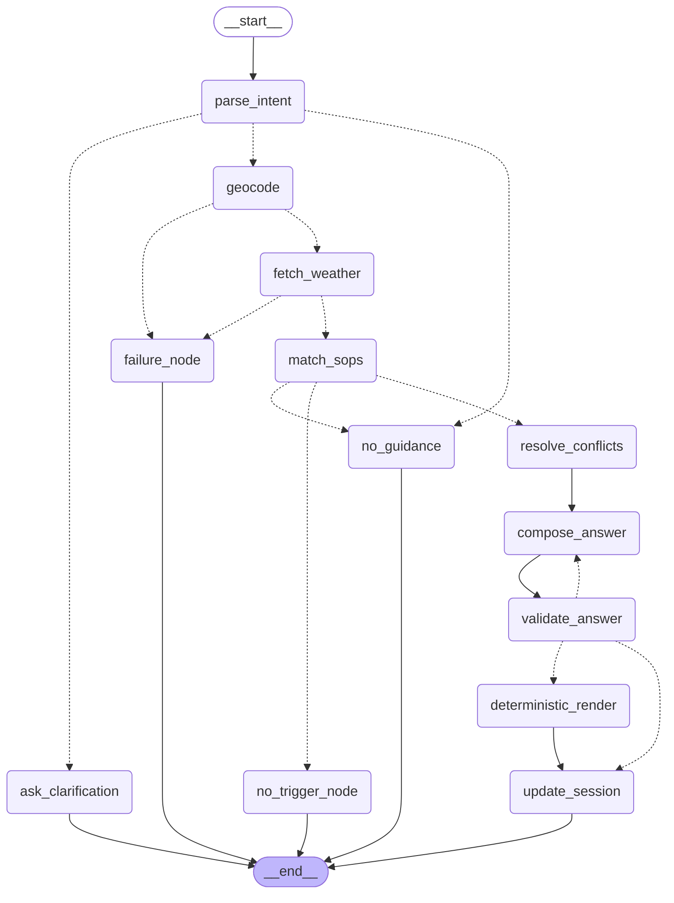

# Weather-Advisory Support Bot (MediBuddy Take-Home Assignment)

[](https://brainwave-weather-bot.streamlit.app)
**Live App URL**: [https://brainwave-weather-bot.streamlit.app](https://brainwave-weather-bot.streamlit.app)

> **Why YAML?** YAML provides policy owners with human-readable, declarative, diffable configuration carrying its own citation metadata, completely decoupled from control-flow code.

---

## 🚀 Quick Start & Installation

### 1. Prerequisites & Environment Setup
```bash
# Clone repository
git clone https://github.com/Shauryakant/Brainwave-.git
cd Brainwave-

# Create virtual environment (Python 3.11 recommended)
python -m venv .venv
# On Windows:
.venv\Scripts\activate
# On Linux/macOS:
source .venv/bin/activate

# Install dependencies
pip install -r requirements.txt
```

### 2. Configure Environment Variables
Copy `.env.example` to `.env` and set your preferred LLM provider and API key:
```bash
cp .env.example .env
```
Edit `.env`:
```env
LLM_PROVIDER=anthropic
LLM_MODEL=claude-3-5-sonnet-20241022
ANTHROPIC_API_KEY=your_actual_anthropic_key_here
```
*(Alternatively, set `LLM_PROVIDER=openai` with `OPENAI_API_KEY`, or `LLM_PROVIDER=google_genai` with `GEMINI_API_KEY`)*

---

## 💻 Running the Application

### A. Run Streamlit Chat Frontend
```bash
streamlit run frontend/streamlit_app.py
```
Open your browser at `http://localhost:8501`.

### B. Run Backend CLI / Graph Debugger
```bash
python -m app.graph
```
Compiles the LangGraph state machine, verifies node wiring, and prints the Mermaid workflow diagram.

### C. Run Test & Evaluation Suite
```bash
# Run unit tests (evaluator, resolver, validators)
python -m pytest tests/

# Run complete 10-case evaluation suite (Cases A-J)
python evals/run_evals.py
```

---

## ⚡ 60-Second Walkthrough: How to Add an 11th SOP Live

To add a new policy SOP **without touching any Python control-flow code**:

1. Open `sops/` directory.
2. Create a new YAML file, e.g., `sops/sop_custom_011_humidity.yaml`:
```yaml
id: SOP-CUS-011
title: High Humidity Advisory for Outdoor Sports
category: exercise
severity: warning
priority: 85
applies_to:
  activities: ["gardening", "sports"]
  audiences: ["*"]
match:
  type: threshold
  all_of:
    - metric: relative_humidity_2m
      agg: max
      window: today
      op: ">="
      value: 85.0
guidance: "High relative humidity peaking at {relative_humidity_2m.max}% creates oppressive conditions. Reduce physical strain and stay hydrated."
rationale: Excessive humidity impairs sweat evaporation during exertion.
owner: Health Operations
version: 1.0.0
last_reviewed: "2026-10-01"
```
3. Save the file. **No app restart required!**
4. On the next chat query (e.g. *"Is it safe for gardening in Bhopal today?"*):
   - The SOP loader reads the new YAML file automatically.
   - The weather module dynamically adds `relative_humidity_2m` to the Open-Meteo API query.
   - The intent parser incorporates `gardening` into the recognized activity taxonomy.
   - The bot matches, evaluates, and cites `SOP-CUS-011` seamlessly!

---

## 📊 Standard Operating Procedures (SOPs) Summary

| ID | Title | Category | Severity | Priority | Condition Summary |
|---|---|---|---|---|---|
| **SOP-SIT-001** | Active Heavy-Rain System | situational | `danger` | 100 | 24h precip >= 64.5mm OR (12h precip >= 40mm AND pressure drop <= -4hPa) *(Overrides All)* |
| **SOP-SIT-002** | Thunderstorm & Lightning | situational | `danger` | 90 | Thunderstorm code (95-99) OR CAPE >= 1000 J/kg with rain prob >= 70% |
| **SOP-EXE-001** | Extreme Heat Stress | exercise | `danger` | 80 | Apparent temp >= 40°C or Actual temp >= 42°C |
| **SOP-EXE-002** | Moderate Heat Advisory | exercise | `caution` | 40 | 34°C <= Apparent temp < 40°C |
| **SOP-EXE-003** | Midday High UV Index | exercise | `warning` | 60 | Midday UV Index >= 8.0 |
| **SOP-EXE-004** | Fog Visibility for Exercise | exercise | `warning` | 50 | Min Visibility <= 1000m |
| **SOP-TRV-001** | High Wind Risk (2-Wheelers) | travel | `warning` | 70 | Wind speed >= 35 km/h or Gusts >= 45 km/h |
| **SOP-TRV-002** | Wet Road Slippage | travel | `warning` | 65 | Precip sum >= 10mm and Precip prob >= 60% |
| **SOP-TRV-003** | Heavy Rain Travel Delays | travel | `caution` | 45 | Precip prob >= 70% |
| **SOP-TRV-004** | Dense Driving Fog | travel | `warning` | 55 | Morning visibility <= 500m |
| **SOP-VUL-001** | Children Heat & Sun Safety | vulnerable_groups | `warning` | 75 | Apparent temp >= 36°C or Midday UV >= 7.0 |
| **SOP-VUL-002** | Elderly Heat & Humidity | vulnerable_groups | `warning` | 72 | Apparent temp >= 35°C and Precip prob >= 40% |
| **SOP-VUL-003** | Hot Pavement Pet Hazard | vulnerable_groups | `caution` | 35 | Afternoon temp >= 32°C |
| **SOP-LEI-001** | Outdoor Picnic Suitability | leisure | `caution` | 30 | Qualitative Fuzzy Rubric (good / mixed / poor) |
| **SOP-INF-001** | Pleasant Weather Guidance | leisure | `info` | 10 | Temp 16-28°C, Wind <= 15 km/h, Precip prob <= 15% *(Includes safety disclaimer)* |

*Note: Threshold values listed are placeholder estimates for demonstration purposes, pending domain expert review.*

---

## 🔄 LangGraph State Machine Architecture



---

## ☁️ Deployment to Streamlit Community Cloud

### Deployment Steps:
1. Push repository to GitHub: `https://github.com/Shauryakant/Brainwave-.git`.
2. Connect repository to **Streamlit Community Cloud** with main file `frontend/streamlit_app.py`.
3. In Streamlit Cloud App Settings -> **Secrets**, paste your API credentials:
   ```toml
   LLM_PROVIDER = "anthropic"
   LLM_MODEL = "claude-3-5-sonnet-20241022"
   ANTHROPIC_API_KEY = "your_key_here"
   ```
4. Deploy! Python 3.11 is pinned via `runtime.txt`.

### Live URL Smoke-Test Checklist:
- [x] Ask *"Is it safe to cycle in Bhopal today?"* -> Verify primary SOP cited and Decision Trace expands cleanly.
- [x] Ask follow-up *"What about this evening instead?"* -> Verify session memory retains location/activity while re-fetching evening data.
- [x] Ask off-topic *"Can you write python code?"* -> Verify honest fallback *"We don't have guidance for that"*.
- [x] Enter nonsense city *"Qzxvbnmlk"* -> Verify honest failure *"I couldn't get live weather for that location"*.
- [x] Click **"New Session"** -> Verify chat history and session context reset.
