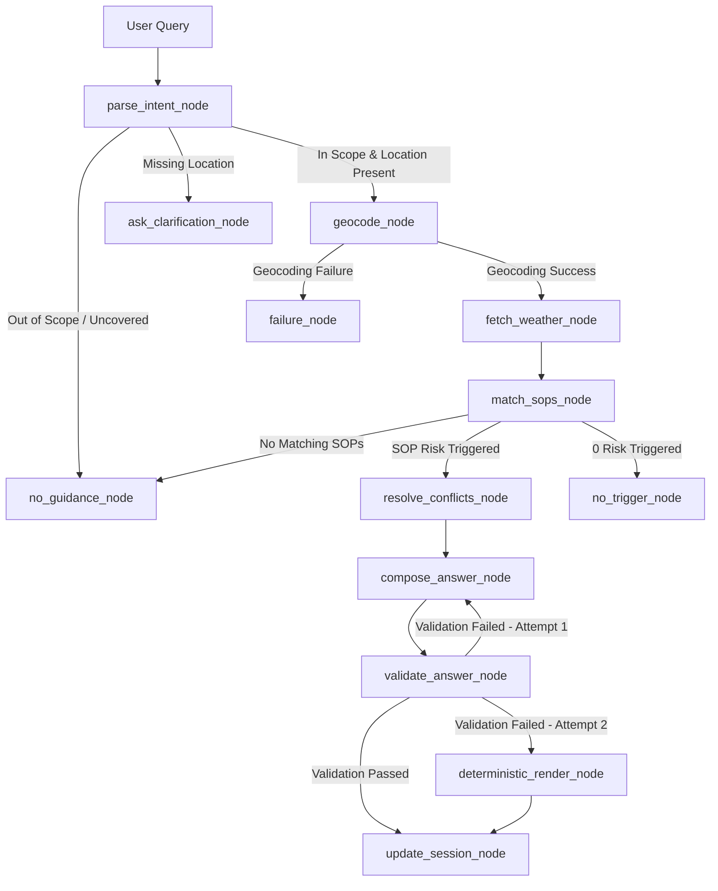

# 🌤️ MediBuddy Weather-Advisory Support Bot

> **Policy-Driven Outdoor Weather Safety Assistant for MediBuddy**  
> *Built with LangGraph, Open-Meteo API, PyYAML SOP Engine, and Streamlit*

---

### 📺 System Demo & Walkthrough Video
[](YOUR_YOUTUBE_VIDEO_LINK_HERE)  
*Click the badge above to watch the full system walkthrough, architecture overview, and live execution demo.*

---

## 📌 Executive Summary & Core Principle

In medical and health advisory applications, **generative AI models must NEVER invent safety advice or weather thresholds**. 

The **MediBuddy Weather-Advisory Support Bot** enforces a **strict deterministic-first control architecture**:
1. **100% Policy-Grounded**: Every piece of safety advice originates directly from written human-approved Standard Operating Procedures (SOPs) stored in version-controlled YAML files (`sops/`).
2. **LLM as a Constrained Phrasing Engine**: The LLM parses user query intents and formats approved policy guidance into natural language. The LLM **never** decides whether an activity is safe.
3. **Number Grounding & Failsafe Validation**: All numerical figures in the output are validated against live Open-Meteo weather API data. If an LLM attempts to alter numbers or hallucinate advice, the system catches it instantly and falls back to deterministic template rendering.

---

## 🏗️ System Architecture & Workflow

The application is engineered as a state machine using **LangGraph** with explicit fallback, retry, and clarification nodes:



### Key Execution Graph Nodes:
- **`parse_intent`**: Schema-constrained Pydantic intent parsing (`in_scope`, `location_text`, `activity_tag`, `audience_tag`, `time_ref`).
- **`geocode`**: Smart Open-Meteo geocoding with multi-word comma fallbacks (`Leh, Ladakh`), landmark stripping (`Juhu Beach` $\rightarrow$ `Mumbai`), and transliteration alias mappings (`cherapunjee` $\rightarrow$ `Cherrapunjee`).
- **`fetch_weather`**: Fetches live hourly/current metrics from Open-Meteo and aggregates them into strict time windows (`today`, `morning`, `midday`, `afternoon`, `evening`).
- **`match_sops`**: Evaluates threshold SOPs deterministically in Python (`>`, `>=`, `<`, `<=`) and fuzzy subjective SOPs via a constrained LLM judge rubric.
- **`resolve_conflicts`**: Deterministically ranks triggered SOPs using base priority, severity bonuses (`critical: +30`, `warning: +20`), and taxonomy match bonuses.
- **`compose_answer`**: Phrases approved policy guidance and pre-filled API numbers into natural conversational text (token-optimized under 400 tokens).
- **`validate_answer`**: Verifies strict number grounding against API readings and SOP citation accuracy.
- **`deterministic_render`**: Failsafe fallback node that renders exact template text without LLM output if validation fails twice.

---

## 📁 Repository Structure

```
.
├── app/
│   ├── config.py           # Environment variables, secrets loader, and time window configs
│   ├── state.py            # TypedDict AdvisoryState and SessionContext schemas
│   ├── sop_loader.py       # Pydantic SOP schemas, dynamic taxonomy & metric extractors
│   ├── geo_weather.py      # Open-Meteo geocoding & windowed metric aggregator
│   ├── sop_engine.py       # Deterministic threshold evaluator & fuzzy LLM judge
│   ├── resolver.py         # Deterministic priority-based conflict resolver
│   ├── intent.py           # Schema-constrained intent parser with state memory
│   ├── compose.py          # LLM composer & deterministic template fallback renderer
│   ├── validators.py       # Number grounding & SOP citation validator
│   └── graph.py            # LangGraph StateGraph, MemorySaver checkpointer & nodes
├── sops/                   # Human-written YAML SOP policies (15 active SOPs)
│   ├── sop_sit_001_heavy_rain.yaml
│   ├── sop_vul_001_child_heat.yaml
│   ├── sop_trv_001_twowheeler_wind.yaml
│   ├── sop_lei_001_picnic_fuzzy.yaml
│   └── ...
├── evals/                  # Comprehensive evaluation suite & empirical results
│   ├── run_evals.py        # Automated test runner for Cases A-J (18 scenarios)
│   └── RESULTS.md          # Real empirical execution log & pass/fail results
├── frontend/
│   └── streamlit_app.py    # Streamlit web app with custom CSS, preset chips & trace card
├── .env                    # Local environment variables (Groq API key)
├── requirements.txt        # Python dependency manifest
└── README.md               # Project documentation
```

---

## ⚡ Key Highlights & Engineering Solutions

### 1. 🔄 Dynamic 11th SOP Extensibility
To add a new business policy (e.g. `SOP-NEW-011`), simply drop a valid YAML file into `sops/`. The system dynamically extracts required weather metrics and taxonomy tags at runtime **without requiring control-flow code modifications**.

### 2. 🧠 Token-Optimized State Memory
Instead of passing full chat transcripts (which bloat prompts and hit Groq's 8,000 TPM limit), the system passes **only a single 4-field state snapshot** (`last_location`, `last_activity`, `last_audience`, `last_time_ref`). Prompt size remains fixed at **~30 tokens** regardless of chat session length.

### 3. 🛡️ Failsafe Number Grounding
If an LLM tries to alter numbers (e.g., rewriting `33.4°C` to `24.5°C`), `validate_number_grounding` detects the ungrounded float, retries composition once, and falls back to `deterministic_render` if needed.

---

## 🚀 Local Setup & Execution Guide

### Prerequisites
- Python 3.10+
- Groq API Key (or OpenAI / Anthropic / Gemini key)

### Step 1: Clone Repository & Create Virtual Environment
```bash
git clone https://github.com/Shauryakant/Brainwave-.git
cd Brainwave-
python -m venv venv
# On Windows PowerShell:
.\venv\Scripts\Activate.ps1
# On Linux/macOS:
source venv/bin/activate
```

### Step 2: Install Dependencies
```bash
pip install -r requirements.txt
```

### Step 3: Configure Environment Variables
Create a `.env` file in the root directory:
```env
LLM_PROVIDER=groq
LLM_MODEL=openai/gpt-oss-120b
GROQ_API_KEY=gsk_your_groq_api_key_here
```

### Step 4: Run the Streamlit Frontend App
```bash
streamlit run frontend/streamlit_app.py
```
Open [http://localhost:8501](http://localhost:8501) in your browser.

---

## 🧪 Evaluation Suite Execution

The repository includes a 10-case evaluation suite covering 18 test scenarios (Cases A-J):

```bash
python evals/run_evals.py
```

### Test Suite Coverage:
| Case ID | Test Category | Description |
|---|---|---|
| **CASE-A** | Clear SOP Match | High wind cycling & extreme child heat |
| **CASE-B** | Paraphrase Robustness | Colloquial expressions ("scooter commute", "play in park") |
| **CASE-C** | Severe Monsoon Conditions | Live multi-city scan + recorded severe monsoon replay |
| **CASE-D** | Edge Cases | Unmapped activities (scuba diving) & off-topic coding queries |
| **CASE-E** | Benign Weather | Pleasant weather advisory with safety disclaimer (`SOP-INF-001`) |
| **CASE-F** | Fault Tolerance | Weather API timeouts & nonsense location handling |
| **CASE-G** | Adversarial Security | Prompt injections, fake SOP-777 citations & hallucinated numbers |
| **CASE-H** | Multi-turn Memory | Conversational state inheritance across follow-up turns |
| **CASE-I** | Policy Extensibility | Dynamic 11th SOP live insertion & malformed schema rejection |
| **CASE-J** | Conflict Resolution | Priority-based ranking (Base Priority + Severity + Taxonomy bonuses) |

*Full empirical results are logged in [`evals/RESULTS.md`](file:///d:/tb/brainwavw/evals/RESULTS.md).*

---

## 🌐 Deployment to Streamlit Community Cloud

1. Push your repository to GitHub (`main` branch).
2. Connect your repository to **Streamlit Community Cloud**.
3. In Streamlit Cloud **App Settings $\rightarrow$ Secrets**, add your API key:
   ```toml
   LLM_PROVIDER = "groq"
   LLM_MODEL = "openai/gpt-oss-120b"
   GROQ_API_KEY = "gsk_your_groq_api_key_here"
   ```
4. Set the main file path to `frontend/streamlit_app.py`.

---

### 📄 License
Developed for the **MediBuddy AI Engineering Take-Home Assignment**.
